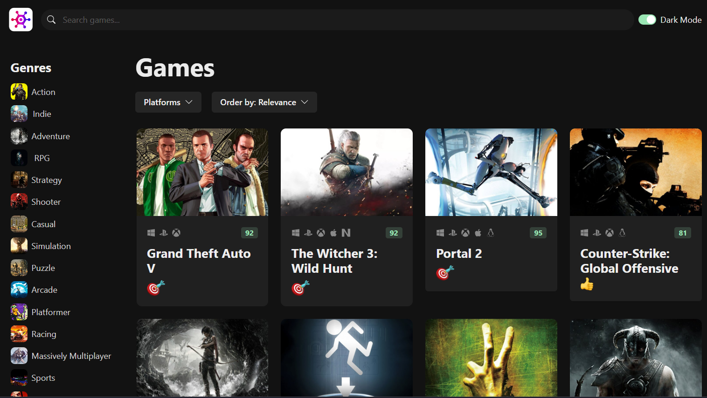

# Modern UI/UX website using ReactTS & ChakraUI

[Live Site](https://game-hub-nu-lake.vercel.app)

This is a modern UI/UX website, built using React, TypeScript, ChakraUI with fully functional search and sorting.

## Technologies

React, Typescript, ChakraUI, Axios

## ## Run Locally

To run this project locally, follow these steps:

1. Clone this repository to your local machine.
2. Run `npm install` to install the required dependencies.
3. Get a RAWG API key at https://rawg.io/apidocs. You'll have to create an account first.
4. Add the API key to **src/services/api-client.ts**
5. Run `npm run dev` to start the web server.

## Lessons Learned

This project really taught me how to work with APIs and how to handle searches and sorting. I got comfortable with API requests and how to handle them with useEffect, and I learned how to use the Chakra UI components as well.
